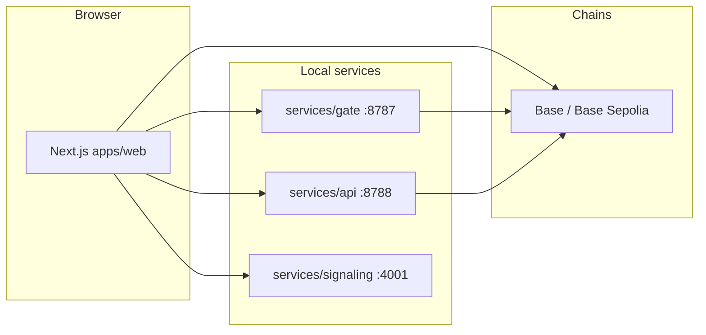

# Gems (pixel-stream-gems)

**Gems** is a monorepo for a creator streaming product: a **Next.js** web app with **Privy** authentication and **wagmi/viem** wallet flows, **WebRTC** rooms over a **signaling** service, a **gate** that issues JWTs (with optional token / Superfluid checks), a **REST API** backed by **Postgres**, and **Solidity** contracts (Foundry) for marketplace, staking, creator tokens, and optional agent-skill purchases.

This README is the entry point for developers and operators. Deeper topics live in linked docs under the repo.

---

## Table of contents

- [Architecture](#architecture)
- [Tech stack](#tech-stack)
- [Prerequisites](#prerequisites)
- [Clone, install, and environment](#clone-install-and-environment)
- [Local development](#local-development)
- [Database (API)](#database-api)
- [Smart contracts (Foundry)](#smart-contracts-foundry)
- [Verification, tests, and CI](#verification-tests-and-ci)
- [Production checklist](#production-checklist)
- [Troubleshooting](#troubleshooting)
- [Repository layout](#repository-layout)
- [Documentation index](#documentation-index)

---

## Architecture

At a high level, the browser talks to the **Next.js** app. For live features, the app uses **HTTP** to the **gate** (room tokens) and **API** (competitions, presenter chat, etc.), and **WebSocket** to **signaling** for WebRTC signaling. On-chain features use **Base / Base Sepolia** RPCs via **wagmi**; optional **0G Galileo** and **Superfluid** integrations are configured through env vars.



---

## Tech stack

| Area | Technologies |
|------|----------------|
| **Web** (`apps/web`) | Next.js 16 (webpack dev/build), React 19, App Router, Tailwind CSS 4, Radix UI, wagmi 3, viem, Privy (`@privy-io/react-auth`, `@privy-io/wagmi`), TanStack Query, Superfluid SDK (streaming UI paths) |
| **API** (`services/api`) | Node, Express 5, Postgres (`pg`), Vitest; optional xAI / 0G compute integration (see env) |
| **Gate** (`services/gate`) | Node, **Fastify** 5 (`tsx`), JWT (`jose`), optional ERC-20 / Superfluid checks via **viem** |
| **Signaling** (`services/signaling`) | Node, WebSocket server for room-based WebRTC signaling |
| **Contracts** (`packages/contracts`) | Foundry, Solidity |

Root `package.json` uses **npm workspaces** (`apps/*`, `packages/contracts`, `services/*`) and pins shared **React 19** / **viem** versions via `overrides`.

---

## Prerequisites

- **Node.js** 20+
- **npm** (workspace install at repo root)
- **[Foundry](https://book.getfoundry.sh/getting-started/installation)** (`forge`, `cast`) for contracts
- **PostgreSQL** if you run the API against a real DB (optional for a quick UI-only pass if endpoints are not exercised)

---

## Clone, install, and environment

```bash
git clone https://github.com/Laszlo23/pixel-stream-gems.git
cd pixel-stream-gems
npm install
cp .env.example .env
```

Edit **`.env` at the repository root**. The Next app loads this file via `apps/web/next.config.mjs`, so you usually do **not** need a duplicate full copy under `apps/web` (you may still symlink `apps/web/.env.local` → `../../.env` for tools that only read the app folder—see comments in [`.env.example`](.env.example)).

**Minimum for a usable local UI**

- **`NEXT_PUBLIC_PRIVY_APP_ID`** — from [Privy](https://dashboard.privy.io). Leave empty only if you intentionally run without Privy (injected browser wallet path; see `.env.example`).
- Align URLs with running services (defaults match local dev):

  | Variable | Typical local value |
  |----------|----------------------|
  | `NEXT_PUBLIC_API_URL` | `http://127.0.0.1:8788` |
  | `NEXT_PUBLIC_GATE_URL` | `http://127.0.0.1:8787` |
  | `NEXT_PUBLIC_SIGNALING_WS` | `ws://127.0.0.1:4001` |

- **`JWT_SECRET`** (gate) — use a long random string in development; must be strong and secret in production.
- **`DATABASE_URL`** (api) — only if you run migrations and hit DB-backed routes.

Full variable reference: **[`.env.example`](.env.example)**. Step-by-step Privy and wallet setup: **[`apps/web/PRIVY_SETUP.md`](apps/web/PRIVY_SETUP.md)**.

---

## Local development

### One command: web + API + gate + signaling

From the repo root:

```bash
npm run dev:full
```

This runs **[`concurrently`](https://www.npmjs.com/package/concurrently)** with four processes: `web`, `api`, `gate`, `ws` (signaling). **Default ports:**

| Service | Port | URL / endpoint |
|---------|------|----------------|
| Next.js | `3000` | [http://localhost:3000](http://localhost:3000) |
| API | `8788` | [http://localhost:8788](http://localhost:8788) |
| Gate | `8787` | `http://127.0.0.1:8787` |
| Signaling | `4001` | `ws://127.0.0.1:4001` (see server log for full URL pattern) |

Use the **same host** in the browser that you allow in the **Privy** dashboard (e.g. `http://localhost:3000`), or embedded login and redirects can fail.

### Run services in separate terminals

| Service | Command | Notes |
|---------|---------|--------|
| Next.js only | `npm run dev` | Same as `npm run dev -w web` |
| API | `npm run dev:api` | Requires `DATABASE_URL` if routes need DB |
| Gate | `npm run dev:gate` | Reads `JWT_SECRET`, `RPC_URL`, optional token checks |
| Signaling | `npm run dev:signaling` | WebRTC signaling (`ws://127.0.0.1:4001`) |

### Frontend-only shortcut

```bash
npm run dev
```

Runs only `apps/web` (no API/gate/signaling). Useful for static pages and UI work when backend env is not set up.

---

## Database (API)

If you use Postgres-backed features:

1. Create a database and set **`DATABASE_URL`** in `.env`.
2. Run migrations from the repo root:

   ```bash
   npm run db:migrate -w api
   ```

Schema and API behavior are documented alongside [`services/api`](services/api) (see [`services/api/COMPUTE_AND_PRESENTER.md`](services/api/COMPUTE_AND_PRESENTER.md) for presenter / 0G notes).

---

## Smart contracts (Foundry)

```bash
npm run forge:build
npm run forge:test
```

Deploy to **Base Sepolia** (reads root `.env` for `PRIVATE_KEY`, `BASE_SEPOLIA_RPC_URL`, optional `BASESCAN_API_KEY`):

```bash
npm run forge:deploy:sepolia
npm run forge:deploy:sepolia:verify   # same + Basescan verification
```

Optional **AgentSkillMarket**:

```bash
npm run forge:deploy:agent-market
npm run forge:deploy:agent-market:verify
```

After deployment, record addresses and transactions in **[`DEPLOYMENTS.md`](DEPLOYMENTS.md)** and set the matching **`NEXT_PUBLIC_*`** contract variables in `.env` and hosting. Copy ABIs from `packages/contracts/out` into `apps/web/src/lib/abis/` when the UI needs new artifacts.

Contract layout and scripts: [`packages/contracts/README.md`](packages/contracts/README.md).

---

## Verification, tests, and CI

| Command | Purpose |
|---------|---------|
| `npm run verify:release` | Forge tests + Next build + API build |
| `npm run test:e2e` | Production Next build + Playwright smoke tests |
| `npm run verify:grant` | `verify:release` + API unit tests + Playwright |
| `npm run verify:all` | `verify:release` + Chromium install + Playwright |

GitHub Actions runs build verification and Playwright on pushes/PRs to **`main`** or **`master`**.

Grant-oriented manual checks: **[`GRANT_READINESS.md`](GRANT_READINESS.md)**.

---

## Production checklist

1. **Web** — Deploy `apps/web` (e.g. Vercel). Set all **`NEXT_PUBLIC_*`** vars from `.env.example`: API, gate, signaling URLs, RPCs, contract addresses, Privy, WalletConnect, optional TURN (`NEXT_PUBLIC_TURN_JSON`).
2. **Privy** — App ID, allowed origins, optional `NEXT_PUBLIC_SITE_URL` for metadata and legal links. Full checklist: [`apps/web/PRIVY_SETUP.md`](apps/web/PRIVY_SETUP.md).
3. **API** — `DATABASE_URL`, **`CORS_ORIGIN`** matching your web origin(s), **`XAI_API_KEY`** if using presenter LLM features.
4. **Gate + signaling** — Strong **`JWT_SECRET`**, chain RPC, token addresses if enforcing balances / flows.
5. **Contracts** — Deploy, verify on Basescan, document in **`DEPLOYMENTS.md`**. For 0G Galileo, document public server wallet and ledger funding per [`services/api/COMPUTE_AND_PRESENTER.md`](services/api/COMPUTE_AND_PRESENTER.md).

**WebRTC / TURN** — See [`services/signaling/TURN.md`](services/signaling/TURN.md). Configure `NEXT_PUBLIC_TURN_JSON` in production when relay servers are available.

---

## Troubleshooting

### “Another next dev server is already running”

Next.js 16 allows only **one** `next dev` instance per `apps/web` directory. Stop the old process (the error prints a **PID** and log path), or:

```bash
pkill -f "next dev"
```

Then start `npm run dev` or `npm run dev:full` again.

### Port already in use (`EADDRINUSE`)

If port **3000** is taken, Next may pick another port (e.g. 3001). Prefer freeing **3000** so Privy allowlists and docs stay consistent, or add the alternate origin in Privy.

### API errors without Postgres

Ensure **`DATABASE_URL`** is valid and migrations have run, or avoid routes that require the DB.

---

## Repository layout

| Path | Description |
|------|-------------|
| [`apps/web`](apps/web) | Next.js App Router app: pages, components, wagmi/Privy, WebRTC client, marketing surfaces |
| [`packages/contracts`](packages/contracts) | Foundry project: `GemsMarketplace`, `FeeVault`, NFT/token factories, staking, registry, optional `AgentSkillMarket` |
| [`services/signaling`](services/signaling) | WebSocket signaling for WebRTC rooms |
| [`services/gate`](services/gate) | HTTP service: JWTs for rooms; optional on-chain gating |
| [`services/api`](services/api) | REST API, Postgres, presenter / optional 0G integrations |
| [`src/`](src/) (repo root) | Legacy Vite-era assets; **primary product path is `apps/web`** |

---

## Documentation index

| Doc | Topic |
|-----|--------|
| [`.env.example`](.env.example) | All environment variables explained |
| [`apps/web/PRIVY_SETUP.md`](apps/web/PRIVY_SETUP.md) | Privy dashboard and app configuration |
| [`GRANT_READINESS.md`](GRANT_READINESS.md) | Grant / release QA checklist |
| [`DEPLOYMENTS.md`](DEPLOYMENTS.md) | On-chain deployment records |
| [`packages/contracts/README.md`](packages/contracts/README.md) | Contract architecture and Forge usage |
| [`services/signaling/TURN.md`](services/signaling/TURN.md) | STUN/TURN for production WebRTC |
| [`services/api/COMPUTE_AND_PRESENTER.md`](services/api/COMPUTE_AND_PRESENTER.md) | Presenter LLM and 0G compute notes |

---

**Repository:** [github.com/Laszlo23/pixel-stream-gems](https://github.com/Laszlo23/pixel-stream-gems)
